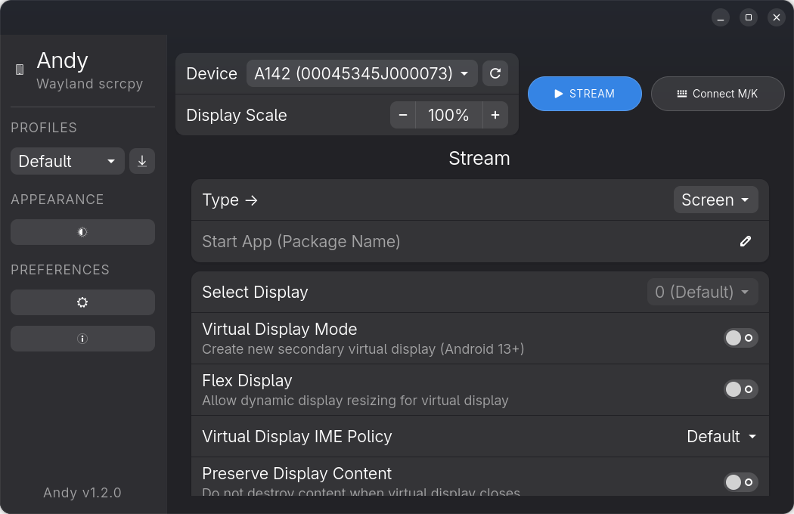
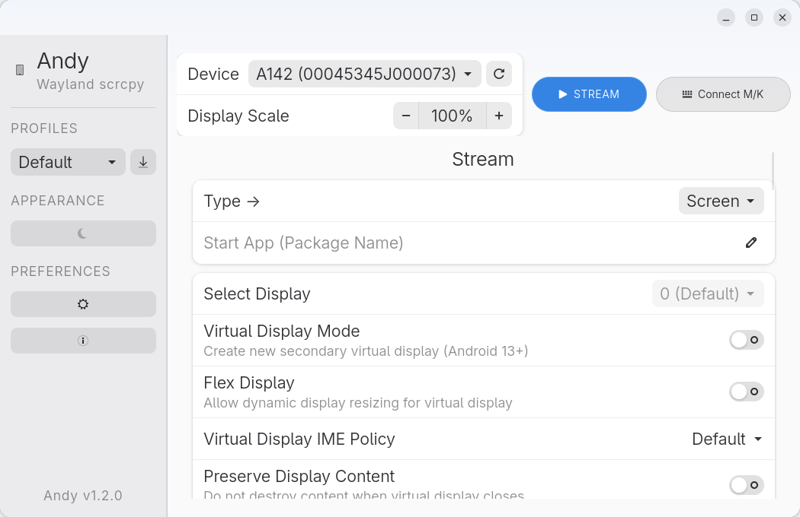

# Andy - Modern GTK4 & Libadwaita scrcpy Wrapper

<div align="center">


**A modern, Wayland-native, Amberol-inspired GUI wrapper for [scrcpy](https://github.com/Genymobile/scrcpy) built with Python, GTK4, and Libadwaita.**

[](#prerequisites)
[](#prerequisites)
[](https://github.com/Genymobile/scrcpy)
[](#)
[](LICENSE)

<br/>

| Dark Mode (Amberol-Style Seamless Header) | Light Mode |
| :---: | :---: |
|  |  |

</div>

---

## Features

- **Seamless Immersion**: Textless, borderless, Amberol-inspired headerbar with floating window controls.
- **Dynamic Resolution**: Probes native display resolution and calculates 5 proportional scaling tiers.
- **Orientation Awareness**: Real-time background detection of device rotation.
- **Connect M/K Bridge**: Zero-video, ultra-low-latency mouse and keyboard forwarding.
- **Camera Streaming**: Front, back, and external sensors with FPS limit, sensor zoom, and high-speed capture.
- **Virtual Displays**: Support for independent Android virtual screens (`--new-display`, `--flex-display`).
- **Input & Peripherals**: UHID gamepad forwarding, custom mouse bindings, and legacy paste emulation.
- **Performance**: VA-API hardware decoding (`--hwdec`), audio latency buffering, and bit-rate tuning.
- **Desktop Integration**: Permanent slim sidebar, desktop quick actions, system sleep inhibition, notifications, and XDG profiles (`~/.config/andy`).

---

## Prerequisites & Installation

Andy requires **Python 3.10+**, **GTK4**, **Libadwaita (1.4+)**, **scrcpy**, and **adb**.

### Fedora / RHEL / CentOS Stream
```bash
sudo dnf install -y python3 python3-pip python3-gobject gtk4 libadwaita-devel scrcpy android-tools android-udev-rules
sudo usermod -aG adbusers $USER
```

### Debian / Ubuntu / Pop!_OS / Linux Mint
```bash
sudo apt update
sudo apt install -y python3 python3-pip python3-venv python3-gi python3-gi-cairo gir1.2-gtk-4.0 gir1.2-adw-1 libadwaita-1-dev scrcpy adb android-sdk-platform-tools-common
sudo usermod -aG plugdev $USER
```

### Arch Linux / Manjaro / EndeavourOS
```bash
sudo pacman -S --needed python python-pip python-gobject gtk4 libadwaita scrcpy android-tools android-udev
sudo usermod -aG adbusers $USER
```

### openSUSE (Tumbleweed / Leap)
```bash
sudo zypper in -y python3 python3-pip python3-gobject typelib-1_0-Gtk-4_0 typelib-1_0-Adw-1 libadwaita-devel scrcpy android-tools
```

### NixOS / Nix Shell
```bash
nix-shell -p python3 python3Packages.pygobject3 gtk4 libadwaita scrcpy android-tools
```

### Void Linux
```bash
sudo xbps-install -Sy python3 python3-pip python3-gobject gtk4 libadwaita scrcpy android-tools
```

---

## Quick Start

```bash
# 1. Clone repository
git clone https://github.com/WolfSekhar/Andy.git
cd Andy

# 2. Build virtual environment
./build.sh

# 3. Launch Andy (enforces Wayland backend)
./run.sh

# 4. (Optional) Install desktop entry & application menu icon
./desktop.sh
```

---

## Android Device Setup

### 1. Enable USB Debugging
1. On Android: **Settings > About Phone** -> Tap **Build Number** 7 times.
2. Go to **Settings > System > Developer Options**.
3. Enable **USB Debugging**.
4. Connect via USB and accept the **Allow USB debugging** RSA prompt.

### 2. Configure Udev Rules (Fix `no permissions`)

- **Fedora / RHEL**:
  ```bash
  sudo dnf install -y android-udev-rules
  sudo usermod -aG adbusers $USER
  ```
- **Debian / Ubuntu**:
  ```bash
  sudo apt install -y android-sdk-platform-tools-common
  sudo usermod -aG plugdev $USER
  ```
- **Arch Linux**:
  ```bash
  sudo pacman -S --needed android-udev
  sudo usermod -aG adbusers $USER
  ```
- **Manual (all distributions)**:
  ```bash
  sudo bash -c 'echo "SUBSYSTEM==\"usb\", ATTR{idVendor}==\"*\", MODE=\"0666\", GROUP=\"plugdev\"" > /etc/udev/rules.d/51-android.rules'
  sudo udevadm control --reload-rules && sudo udevadm trigger
  ```
*(Log out and log back in for group permissions to take effect).*

### 3. Wireless ADB Setup
```bash
# Connect via USB once, then enable TCP mode
adb tcpip 5555

# Disconnect USB cable and connect wirelessly
adb connect <PHONE_IP_ADDRESS>:5555
```

---

## CLI & Shortcuts

### Command-Line Options
```bash
./run.sh --start                # Launch stream immediately
./run.sh --connect-mk           # Start in Keyboard & Mouse bridge mode
./run.sh -s <SERIAL>            # Target specific device serial
```

### Keyboard Shortcuts
| Shortcut | Action | Shortcut | Action |
| :--- | :--- | :--- | :--- |
| `Ctrl + Enter` | Start / Stop stream | `Ctrl + S` | Save active profile |
| `Ctrl + R` | Refresh devices | `Ctrl + ,` | Open Settings |
| `Ctrl + Q` | Quit application | `F1` | About Andy |

---

## Automated Tests

```bash
./venv/bin/pytest tests/ -v
```
*Full test suite covering scrcpy 5.0 flags, adaptive UI, XDG paths, and the Amberol titlebar passes 100%.*

---

## License

Licensed under [GPL-3.0](LICENSE). Powered by [scrcpy](https://github.com/Genymobile/scrcpy) and [Libadwaita](https://gitlab.gnome.org/GNOME/libadwaita).
